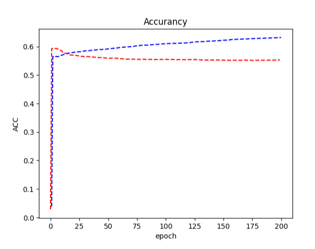

# FDU_NLP_Beginner_Task1
## Introduction
**Task Description: Implement text classification based on logistic/softmax regression** 

A simple text-classification task using Numpy.

It`s such a easy project without many difficulties that just a single node neural network is used to achieve this task using softmax regression.
## Dataset
***Rotten Tomatoes dataset*** is used in this project, you can get from [here](https://www.kaggle.com/competitions/sentiment-analysis-on-movie-reviews/overview/citation).
## HypreParameters
In this project, **dataset is divided according to the ratio of** ***3:7***.

**Epoch** is ***200*** and The **learning rate** is set to ***[10, 1, 0.1, 0.01]***

The data is embedding by ***Bag-of-Words*** model.

## Results

One of the results is here.

